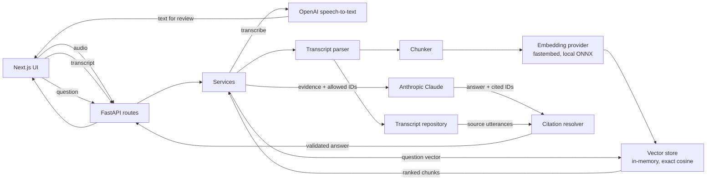

# Meeting Intelligence Assistant

Ask questions about a meeting and get an answer that is backed by the transcript — with the
speaker, timestamp and exact quote that support it. The model never supplies that evidence: it
returns utterance identifiers, which are validated against the transcript and resolved from
source data. A citation that cannot be verified is discarded before it reaches the screen, and an
answer with no surviving evidence is shown as unverified rather than as fact.

---

## What it does

1. **Ingest a transcript** — paste text, or upload/record audio and have it transcribed first.
2. **Review before indexing** — transcription is lossy exactly where it matters (names, numbers,
   decisions), so text is editable until you approve it.
3. **Index the meeting** — deterministic parsing into utterances, speaker-aware chunking, dense
   embeddings, meeting-scoped vector storage.
4. **Ask a question** — retrieval finds relevant chunks *within that one meeting*.
5. **Generate a grounded answer** — Claude answers from the retrieved evidence only, citing
   utterance IDs.
6. **Validate every citation** — IDs are checked against the meeting and the evidence actually
   supplied; speaker, timestamp and quote are read from the stored transcript.
7. **Show the evidence** — each citation renders as a card; clicking it jumps to and highlights
   that line in the transcript.

## Demo flow

```
Record / Upload / Paste
        ↓
  Review transcript        ← human correction happens here, before anything is indexed
        ↓
   Ingest meeting
        ↓
   Chunk + embed
        ↓
  Retrieve evidence        ← scoped to one meeting
        ↓
  Generate answer          ← one LLM call, structured output
        ↓
 Validate citations        ← deterministic, no model involved
        ↓
   Show evidence
```

## Key differentiator: evidence-first design

Most RAG demos ask the model to produce a quote and a speaker alongside its answer. That is
precisely the part a language model is least reliable at, and the part a reviewer most needs to
trust.

Here the model's only evidential output is a list of utterance IDs. It is never asked for quote
text, a speaker name, or a timestamp — the response schema has no field for them.

Every returned ID must pass three checks before it survives:

| Check | Rejects |
|---|---|
| The ID belongs to the meeting being asked about | `wrong_meeting` |
| The utterance exists in that transcript | `not_found` |
| It was among the evidence actually shown to the model | `not_allowed` |

The third check is the strict one: the model cannot cite a real line it was never given, even if
that line happens to be a good answer. Surviving IDs are resolved from the stored transcript, so
speaker, timestamp and quote are always source data. Invalid citations are dropped and logged;
they never reach the API response.

This makes fabricated evidence a structural impossibility rather than a prompting hope —
`ResolvedCitation` has exactly one constructor, and it reads from a stored `Utterance`.

## Architecture



Note the two arrows into the resolver: the model supplies IDs, the repository supplies the
evidence. They meet only at validation.

### Backend structure

Five layers, dependencies pointing inward:

```
app/api/        FastAPI routes, request/response schemas, error translation
app/services/   Orchestration: ingestion, retrieval, generation, citations, transcription
app/domain/     Pure logic: parser, chunker, timestamps, models. No I/O, no framework
app/adapters/   Concrete providers behind Protocols: embeddings, vectorstore, repository, llm, stt
app/core/       Config, structured logging, error hierarchy, composition root
```

Every adapter sits behind a `typing.Protocol` declared in its own `base.py`, so services are
written against interfaces and never against a vendor SDK:

| Protocol | Real implementation | Test double |
|---|---|---|
| `EmbeddingProvider` | `FastEmbedProvider` (local ONNX) | `FakeEmbeddingProvider` |
| `VectorStore` | `InMemoryVectorStore` | — (the real one is already in-process) |
| `TranscriptRepository` | `InMemoryTranscriptRepository` | — |
| `LLMProvider` | `AnthropicLLMProvider` | `FakeLLMProvider` |
| `SpeechToTextProvider` | `OpenAISpeechToTextProvider` | `FakeSpeechToTextProvider` |

Two architectural rules are enforced by tests, not convention: the domain layer imports no web
framework and no network client, and the adapter layer imports no web framework. Both are checked
by importing the modules in a subprocess and inspecting `sys.modules`, which catches transitive
imports too.

### Frontend structure

One stateful container, everything else presentational — no state framework.

```
src/app/           Next.js App Router entry and design tokens
src/lib/api.ts     Typed client; the only place a URL or fetch appears
src/lib/format.ts  Slug/DOM-id/duration helpers
src/components/    app-shell (owns all state) + sidebar, new-meeting, transcript-editor,
                   transcript-viewer, audio-input, recorder, question-panel, answer-card,
                   evidence-card, toast, ui
```

## RAG approach

What is actually implemented, end to end:

- **Deterministic transcript parsing** — one supported format, `[HH:MM:SS] Speaker: text`, with
  multi-line continuation. Malformed input is rejected with a line number rather than guessed at.
- **Utterances are the citation unit.** Stable IDs of the form `{meeting_id}:u{index}`.
- **Chunks are the retrieval unit.** A chunk records the exact utterance IDs it was built from.
- **Overlapping, speaker-aware chunking** (below).
- **Dense embeddings** from a locally executed ONNX model.
- **Meeting-scoped retrieval** — exact cosine similarity, top-k, never across meetings.
- **Evidence context assembled from utterances**, deduplicated and restored to transcript order.
- **Structured answer generation** via Anthropic, constrained to a schema.
- **Deterministic citation validation** outside the model.

Not implemented, and not claimed: hybrid/BM25 retrieval, reranking, query rewriting, agents,
conversation memory, cross-meeting search, or any persistence beyond process memory.

## Chunking strategy

Meeting transcripts arrive already segmented by speaker turn, which is free structure worth
using. The chunker accumulates consecutive utterances until the rendered text would exceed a
**700-character target**, and never splits an utterance — that would destroy the citation unit.

Adjacent chunks **overlap by exactly one utterance**. This matters for meetings specifically: a
proposal and the "agreed" that answers it must not land in different chunks.

Two edge cases are handled explicitly:

- **An utterance longer than the target** becomes its own chunk and is allowed to exceed the
  budget, because the alternative is splitting it.
- **When overlap would add nothing** — two large adjacent utterances that cannot share a chunk —
  the overlap is dropped rather than emitting a chunk that merely repeats its predecessor.

Chunk text is rendered with speaker labels inline (`Sarah: We need to delay…`), so names
participate in the embedding rather than living only in metadata.

## Embeddings

- **Real provider:** `fastembed` running `BAAI/bge-small-en-v1.5` (384-dim) locally via ONNX.
  Chosen over a hosted embedding API so the project needs one API key rather than two, and over a
  PyTorch model so there is no multi-gigabyte install. The model downloads once on first
  ingestion and is cached.
- **Test provider:** a deterministic feature-hashing fake. It hashes word tokens into buckets
  (via `hashlib`, never Python's process-seeded `hash()`), so texts sharing vocabulary produce
  similar vectors. That makes ranking assertions meaningful offline — a random-vector fake would
  make them arbitrary.
- **Dimension safety:** the provider's dimension is the vector store's dimension, derived rather
  than configured twice. Both the ingestion and retrieval services refuse to construct if the two
  disagree, and the store validates every vector on insert and query.
- **Vector store:** exact cosine over a NumPy matrix, scoped per meeting, with stable tie-breaking
  by insertion order. At roughly a hundred chunks per meeting, exact search is faster than
  building an ANN index and is *reproducible*, which is what lets retrieval tests assert rankings.

**In production** this becomes the adapter to replace first: a managed vector store for
durability and cross-process access. The `VectorStore` Protocol is the seam; no service code
changes.

## LLM and prompting

- **Provider:** Anthropic, `claude-sonnet-5` by default, configurable via `ANTHROPIC_MODEL`.
- **Structured output is mandatory** — the SDK constrains generation to the answer schema and
  returns a validated object, so there is no JSON parsing or repair code.
- **The prompt states the allowed utterance IDs explicitly**, in addition to the evidence block,
  so the constraint is unambiguous.
- **System rules** forbid outside knowledge, forbid inventing IDs, forbid inferring decisions or
  action items that are not explicitly supported, and require `insufficient_evidence` when the
  meeting does not answer the question.
- **One retrieval call, one LLM call.** No retries, no agent loop, no second pass.

A note on determinism: current Claude models removed the sampling parameters, so `temperature` is
not available (sending it is a 400). Determinism comes from the constrained schema plus a modest
reasoning-effort setting. A test asserts no sampling parameter is ever sent.

## Guardrails

| Guardrail | Where |
|---|---|
| Retrieval is scoped to exactly one meeting | `RetrievalService`; cross-meeting search is not reachable |
| The model is told exactly which IDs it may cite | `adapters/llm/prompts.py` |
| Every citation is validated deterministically | `services/citations.py` |
| Citations naming another meeting are rejected | reason `wrong_meeting` |
| Invented IDs are rejected | reason `not_found` |
| Real IDs the model was not shown are rejected | reason `not_allowed` |
| Quote, speaker and timestamp resolved from the transcript | `ResolvedCitation.from_utterance` — the only constructor |
| No evidence retrieved → the model is never called | `AnswerGenerationService` returns a fixed insufficient-evidence answer |
| An answer with zero valid citations is marked unverified | UI trust state, not silently trusted |
| API keys never appear in errors or logs | provider errors carry an exception *type*, never its message |
| Upload type, extension and size validated before transcription | `services/transcription.py` |
| Invalid-citation logs carry IDs and reasons only, never transcript text | asserted by test |

## Voice transcription

Audio is transcribed by OpenAI (`whisper-1` by default — the only current model that reports
language and duration; the `gpt-4o-transcribe` family returns text alone and rejects the verbose
response format, which the provider handles by selecting the format from the configured model).

**Transcription is deliberately separate from ingestion.** `POST /api/transcriptions` returns text
and stores nothing. The user reviews and corrects it, then submits it through
`POST /api/transcripts` like any other transcript. This keeps one canonical ingestion path and
prevents silently indexing a bad transcription — every downstream answer would inherit the error
while looking perfectly grounded.

**Current limitation, stated plainly:** there is no speaker diarisation. Raw speech-to-text
returns prose, not `[HH:MM:SS] Speaker: text`, so **audio-derived transcripts usually need
editing into the supported format before ingestion succeeds**. The editable review step makes
that possible, but it is manual. Diarised transcription (OpenAI's `gpt-4o-transcribe-diarize`,
or a diarisation pass) is the first thing to add here.

## Quality and evaluation

Automated coverage, by area:

| Area | Covered |
|---|---|
| Timestamp parsing | formats, ranges, round-trip, rejection |
| Transcript parser | valid input, continuations, blank lines, malformed lines with line numbers |
| Chunker | overlap, coverage, determinism, oversized utterances, no duplicate chunks |
| Embeddings | determinism across processes, dimensions, empty input, zero vectors |
| Vector store | ranking, top-k, meeting isolation, upsert replacement, tie-breaking |
| Ingestion | re-ingestion replacement, failure ordering, no half-written state |
| Retrieval | scoping, pass-through ranking, validation, empty results |
| Generation | evidence assembly, one LLM call, insufficient-evidence short-circuit |
| Citation resolver | valid/invalid/duplicate citations, resolution from source, log hygiene |
| Speech-to-text | upload validation, provider mapping, secret handling |
| API | every endpoint, uniform error bodies, request IDs |
| Architecture | domain and adapter layers import no web framework |
| Frontend | API client, trust states, evidence→transcript mapping, recorder states |

**Backend: 747 passing, 10 deselected. Frontend: 79 passing.**

A count is not a quality measure, so what it does *not* cover matters more: there is **no
retrieval-quality evaluation in this repository**. No recall@k, no citation-precision
measurement, no golden-question dataset, no groundedness scoring. Retrieval decisions (dense-only,
`k=5`, 700-character chunks) are reasoned but **unmeasured**. See
[docs/productionisation.md](docs/productionisation.md) for what a real evaluation harness needs.

## Observability

- **Structured JSON logs** via `structlog`; uvicorn's own logs are routed through the same
  formatter so output is uniform.
- **Request IDs** — accepted from `X-Request-ID` or generated, bound to the logging context, and
  echoed on the response, so a bad citation warning can be traced to the request that caused it.
- **Domain events**: `transcript.ingested`, `retrieval.completed`, `answer.generated`,
  `audio.transcribed`.
- **Warnings that matter**: `citation.invalid` (with `meeting_id`, `utterance_id`, `reason`) and
  `answer.no_valid_citations`.
- **No transcript text in citation warnings** — identifiers and reasons only, since these are the
  lines most likely to be shipped to a log aggregator.

## Productionisation, scaling and privacy

Kept in a separate document so this page stays readable:
**[docs/productionisation.md](docs/productionisation.md)** — AWS target architecture and its
trade-offs, scaling strategy, data protection, and the evaluation harness this project would need
before anyone trusted its answers.

## Key engineering decisions

| Decision | Choice | Why |
|---|---|---|
| Citation unit | Utterance | One speaker, one timestamp, one quote — exactly explainable |
| Retrieval unit | Chunk | Enough surrounding dialogue to be semantically findable |
| Chunk overlap | One utterance | Keeps a question and its answer together |
| Vector store | In-memory, exact | Reproducible rankings; at this scale an index is slower |
| Embeddings | Local ONNX (fastembed) | One API key instead of two; no GPU, no torch |
| Answer provider | Anthropic + structured output | Schema-constrained generation removes parsing |
| Speech-to-text | OpenAI (hosted) | No multi-GB local model for a reviewer to download |
| Transcription vs ingestion | Separate endpoints | Human review before anything is indexed |
| Citation validation | Deterministic, outside the model | The model is not trusted to grade itself |
| Provider boundaries | `typing.Protocol` | Swappable and testable without vendor SDKs |
| Frontend state | Local React state | Four endpoints do not justify a state framework |
| Error contract | One `AppError` hierarchy → one JSON shape | Domain code raises; the API layer translates |

## Deliberate scope exclusions

Not built, and not stubbed: authentication, persistence, multi-tenancy, hybrid/BM25 retrieval,
reranking, speaker diarisation, realtime or streaming transcription, conversation memory,
cross-meeting analysis, streaming answers, confidence scoring.

Each is a real production requirement; [docs/productionisation.md](docs/productionisation.md)
covers where they fit. They are excluded here because a small system that is correct and
explainable demonstrates more than a large one that is neither.

## AI-assisted development

**Claude Code was used extensively throughout — as a pair-programming and implementation
assistant, not as a code generator left unchecked.** The process:

- **Architecture and phase boundaries were decided first**, before any code. The layering,
  the citation-unit/retrieval-unit split, and the provider Protocols were fixed up front.
- **One branch per phase**, each reviewed and merged before the next began. The git history
  reflects this: eleven phases, each a self-contained change.
- **Explicit contracts before implementation.** Each phase began with a written file list, an
  algorithm description, and the edge cases to be decided — agreed before code was written.
- **Every phase ended with the full suite**: `pytest`, `ruff check`, `ruff format --check`,
  `mypy` on the backend; `eslint`, `tsc`, `build`, `vitest` on the frontend.
- **Provider SDKs were inspected locally rather than assumed.** The Anthropic and OpenAI surfaces
  were introspected in the installed packages before writing against them, which caught real
  details: current Claude models reject `temperature`; only `whisper-1` supports `verbose_json`.
- **Deliberate regression boundaries.** Phase 7 shipped a test asserting a hallucinated citation
  passed through untouched; Phase 8 flipped that same test to assert it is discarded. The
  before/after is visible in history rather than asserted in prose.
- **AI output was not accepted without verification.** Several suggestions were wrong and were
  corrected: a chunker test that asserted overlap where the algorithm correctly produced none, a
  React effect that would have caused a hydration mismatch, an ESLint version that does not exist.

## With more time

In priority order:

1. **Durable vector storage** — the in-memory store is the single biggest gap between this and
   something deployable.
2. **Diarised transcription** — closes the audio→ingestion gap that currently needs manual editing.
3. **Evaluation harness, then retrieval improvements** — recall@k and citation precision on a
   golden set *first*, so hybrid retrieval or reranking can be justified by data rather than
   assumed.
4. **Background ingestion** — embedding a long meeting should not block an HTTP request.
5. **Authentication and tenant isolation** — meeting content is sensitive by default.
6. **Cross-meeting intelligence** — "what did we decide about X across the quarter".
7. **Streaming answers** — a latency-perception improvement, not a capability one.

## Running locally

Requires Python 3.12+ and Node 20+.

```bash
make setup          # venv + backend deps + frontend deps + .env files
make dev-backend    # http://localhost:8000  (docs at /docs)
make dev-frontend   # http://localhost:3000
```

Or explicitly:

```bash
# Backend
cd backend
python3 -m venv .venv
.venv/bin/python -m pip install -e ".[dev]"
cp .env.example .env
.venv/bin/python -m uvicorn app.main:app --reload --port 8000

# Frontend (second terminal)
cd frontend
npm install
cp .env.example .env.local
npm run dev
```

### Provider keys

| Key | Needed for | Without it |
|---|---|---|
| *(none)* | ingest, transcript viewing, retrieval | works fully |
| `ANTHROPIC_API_KEY` | `POST /api/answers` | returns `502`, UI shows a provider error |
| `OPENAI_API_KEY` | `POST /api/transcriptions` | returns `502`; paste still works |

Set them in `backend/.env`. They are never logged, never returned in errors, and never baked into
an image. On first ingestion the embedding model (~130 MB) downloads once and is cached.

## Running with Docker

```bash
cp backend/.env.example backend/.env   # add provider keys
docker compose up --build              # frontend :3000, backend :8000
```

`NEXT_PUBLIC_API_BASE_URL` is a **build argument**, because Next.js inlines `NEXT_PUBLIC_*` into
the client bundle at build time. It must be an address the *browser* can reach — `http://localhost:8000`
by default, not a compose service name, since the request originates on the user's machine.

## API endpoints

| Method | Path | Purpose |
|---|---|---|
| `GET` | `/health` | Liveness |
| `POST` | `/api/transcripts` | Parse, chunk, embed and index a transcript |
| `GET` | `/api/transcripts` | List indexed meetings |
| `GET` | `/api/transcripts/{meeting_id}` | Transcript metadata and utterances |
| `DELETE` | `/api/transcripts/{meeting_id}` | Remove a meeting and its vectors |
| `POST` | `/api/transcriptions` | Transcribe audio (does **not** index) |
| `POST` | `/api/answers` | Grounded answer with validated citations |
| `POST` | `/api/retrieval` | Ranked chunks — debugging and evaluation only |

Interactive docs at `http://localhost:8000/docs`.

## Tests

```bash
make check              # everything
make check-backend      # pytest, ruff, ruff format, mypy
make check-frontend     # eslint, tsc, next build, vitest
```

Tests needing network or a model download are excluded by default and opt-in:

```bash
cd backend && .venv/bin/python -m pytest -m integration     # needs the relevant API key
```

## Demo

Sample transcripts are in [`sample_data/`](sample_data/). The scripted walkthrough is
[docs/demo-script.md](docs/demo-script.md).

Screenshots are not committed. To capture them, run the app, follow the demo script, and save to
`docs/screenshots/`.

## Known limitations

- **No persistence.** Everything lives in process memory; restarting the backend clears all
  meetings. This is the first thing to change for real use.
- **No evaluation data.** Retrieval quality is unmeasured (see above).
- **Audio transcripts usually need manual formatting** before ingestion, because there is no
  diarisation.
- **Single-format parser.** Only `[HH:MM:SS] Speaker: text`. Other exports (WebVTT, Zoom, Otter)
  would each need a parser; the format is validated strictly with line-numbered errors rather
  than guessed at.
- **No authentication.** Anyone who can reach the API can read every meeting in it.
- **In-memory vector search is single-process** — it does not survive a restart or scale to
  multiple workers.
- **Dense-only retrieval.** Questions turning on an exact rare token (a project codename, a
  figure) may retrieve less well than hybrid search would.
- **Answer latency is unoptimised** — one synchronous retrieval and one LLM call, no caching.
